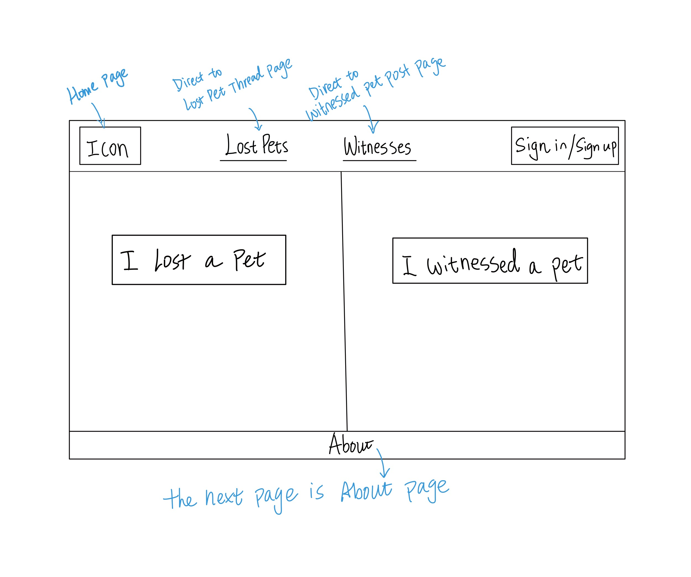
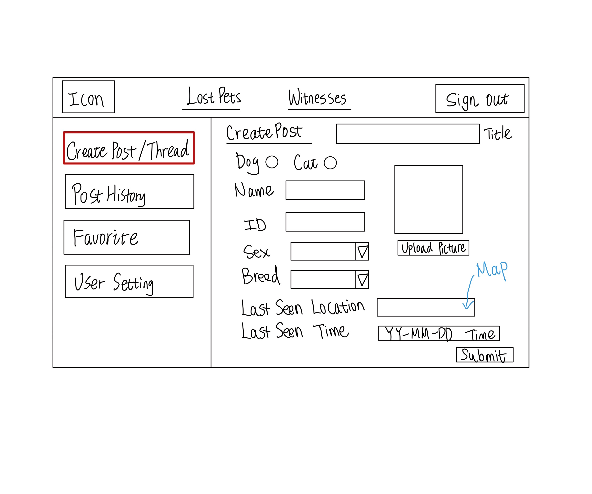
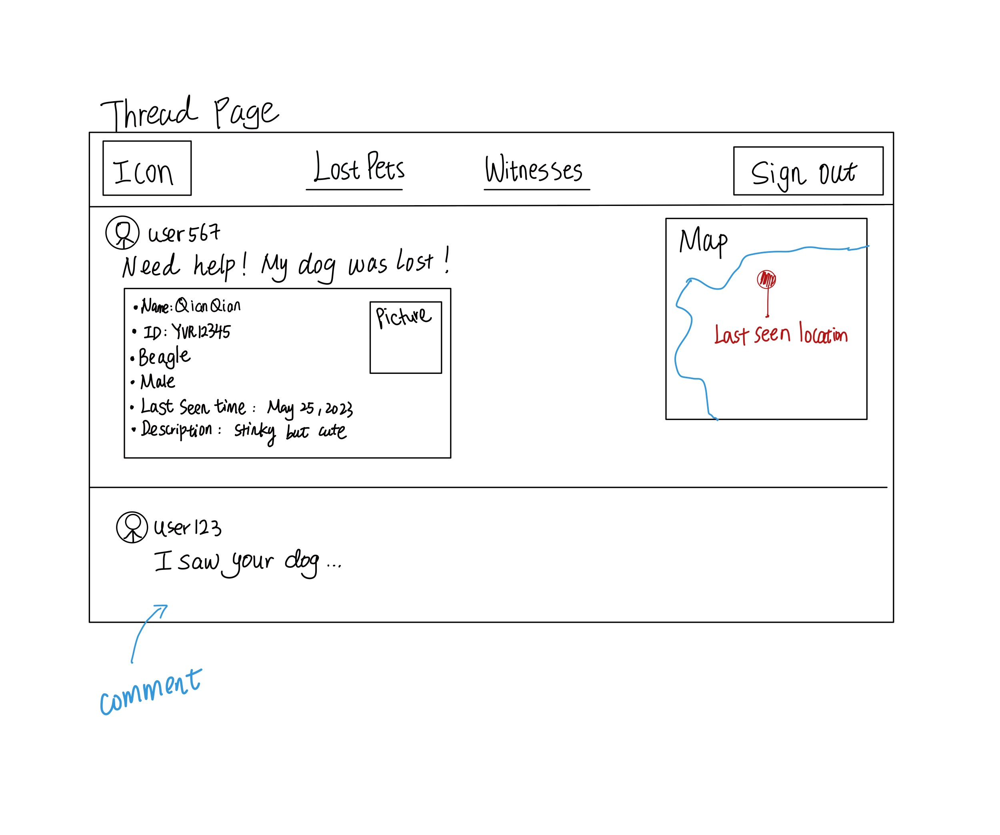

# FurFinder

**FurFinder** is a user-friendly web application committed to reuniting lost pets with their families. Why us? First, we are safe. All the users must register to browse our forum, which guarantees the authenticity of the forum content. Besides, we are fast. Once someone comments on your post, an email will be sent to you immediately, to ensure that you don’t miss a little chance of getting your pet back. Finally, we are smart. We leverage an integrated mapping feature to display pets' last-seen locations and employ an intelligent algorithm to suggest potential connections between posts. Whether you've lost a pet or found one, FurFinder is your go-to platform for swift and reliable assistance.

## Project Description

Who is it for?
- The missing pet tracking web app is for pet owners who have lost their cats or dogs (losers) and for other users who want to help locate missing pets (finders).
    
What will it do? (What "human activity" will it support?)
- Generally, our web app facilitates the activity of searching for and locating missing pets by enabling information sharing between losers and finders.

What type of data will it store?
- The site will store data including but not limited to user information, threads, pictures, text, and geolocations.

What will users be able to do with this data?
- Users will be able to create and browse lost pet threads, view and upload pictures and textual descriptions, and report possible sightings.

What is some additional functionality you can add/remove based on time constraints?
- Providing an option for users to subscribe to email or push notifications for updates on relevant lost pet threads.
- Implementing a reporting system for inappropriate or false information.

## Project Task Requirements
- Minimal requirements (will definitely complete)
  - be able to create, update, and close a thread 
  - under a thread, be able to comment and reply to comments
  - be able to create, update, and delete a post
- Standard requirements (will most likely complete)
  - user login / sign up 
  - be able to favour a thread/post
  - be able to search a thread/post, filter or list threads/posts in different orders
  - be able to integrate a thread map under a thread
  - be able to convert a post to a point on the main map
- Stretch requirements (plan to complete at least 1!)
  - link a post to a thread by developing pet matching algorithms
  - send notifications to thread owners
  - draw a target area on the map

## Minimal Requirements Break-down
1. Be able to create, update, and close a thread
- user can create a thread with essential information such as pet name, ID, sex, breed, last seen location and time, etc.
- user can update a thread and change or add any related information
- user can close (archive) or delete his/her threads
2. Under a thread, be able to comment and reply to comments
- under a thread, other users can add comments related to the missing pet
- under a thread, the original poster can reply to comments
- under a thread, other users can reply to any comments as well

## Sketch Prototypes

